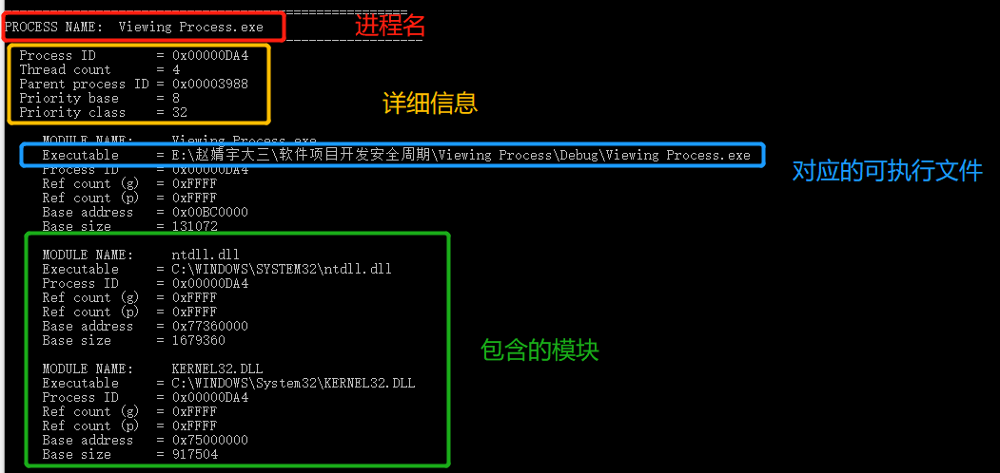
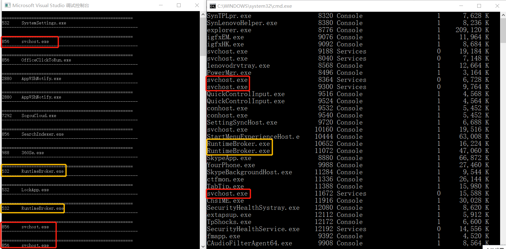
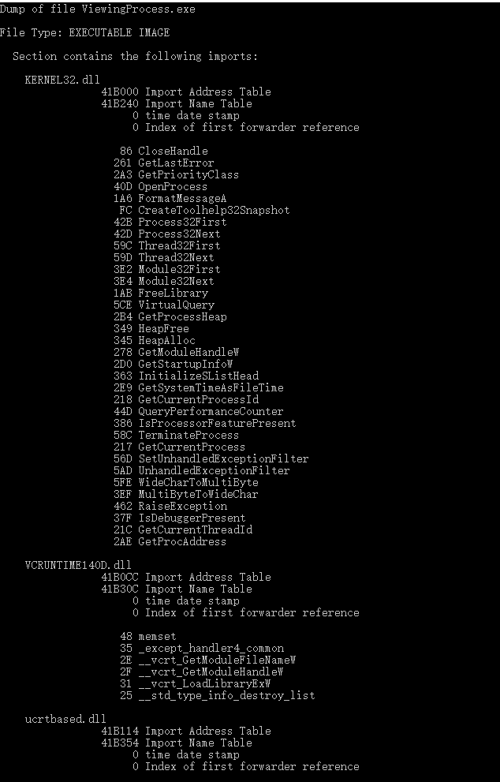
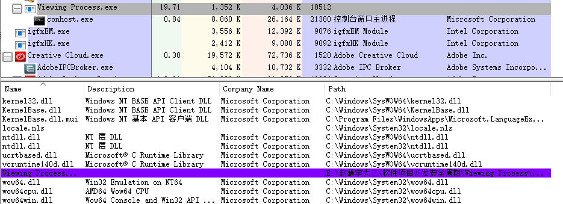
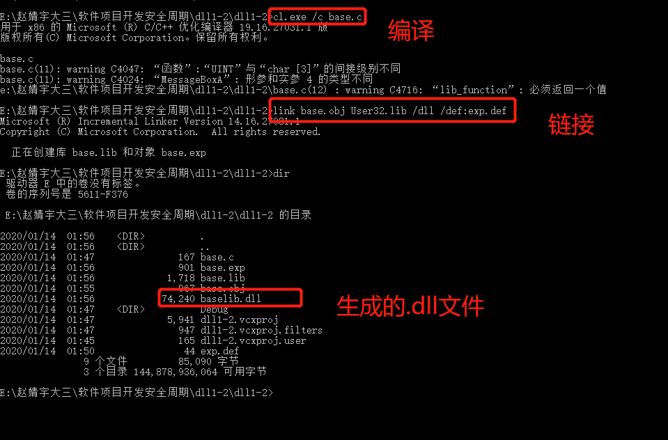
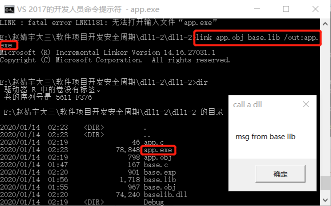
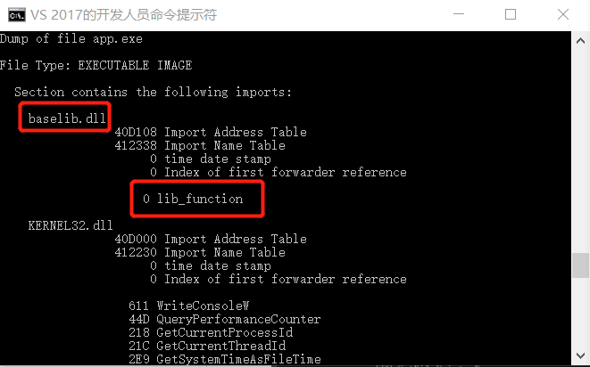
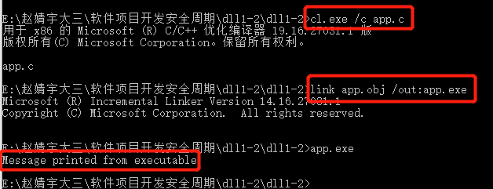
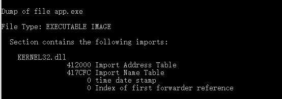

# DLL注入初探

## 实验目的

* 会编写dll。把.c文件编译为obj文件，把obj文件和lib文件链接为新的dll和lib文件。注意使用def文件定义导出函数。
* 编写一个exe，调用第一步生成的dll文件中的导出函数。方法是
  * link是，将第一步生成的lib文件作为输入文件
  * 保证dll文件和exe文件在同一个目录，或者dll文件在系统目录
* 第二步调用方式称为load time 特点是exe文件导入表中会出先需要调用的dll文件名及函数名，并且在link 生成exe是，需明确输入lib文件。还有一种调用方式称为 run time。参考上面的链接，使用run time的方式，调用dll的导出函数。包括系统API和第一步自行生成的dll，都要能成功调用。

## 实验过程

### 模块遍历

#### Taking a Snapshot and Viewing Processes分析

分析程序源代码，可以遍历当前系统中所有的进程以及所有的模块和线程列表

```c
#include <windows.h>
#include <tlhelp32.h>
#include <tchar.h>
#include <stdio.h>
//  Forward declarations:
BOOL GetProcessList( );
BOOL ListProcessModules( DWORD dwPID );
BOOL ListProcessThreads( DWORD dwOwnerPID );
void printError( TCHAR* msg );

int main( void )
{
  GetProcessList( );
  return 0;
}

BOOL GetProcessList( )
{
  HANDLE hProcessSnap;
  HANDLE hProcess;
  PROCESSENTRY32 pe32;
  DWORD dwPriorityClass;

  // Take a snapshot of all processes in the system.
  hProcessSnap = CreateToolhelp32Snapshot( TH32CS_SNAPPROCESS, 0 );
  if( hProcessSnap == INVALID_HANDLE_VALUE )
  {
    printError( TEXT("CreateToolhelp32Snapshot (of processes)") );
    return( FALSE );
  }

  // Set the size of the structure before using it.
  pe32.dwSize = sizeof( PROCESSENTRY32 );

  // Retrieve information about the first process,
  // and exit if unsuccessful
  if( !Process32First( hProcessSnap, &pe32 ) )
  {
    printError( TEXT("Process32First") ); // show cause of failure
    CloseHandle( hProcessSnap );          // clean the snapshot object
    return( FALSE );
  }

  // Now walk the snapshot of processes, and
  // display information about each process in turn
  do
  {
    _tprintf( TEXT("\n\n=====================================================" ));
    _tprintf( TEXT("\nPROCESS NAME:  %s"), pe32.szExeFile );
    _tprintf( TEXT("\n-------------------------------------------------------" ));

    // Retrieve the priority class.
    dwPriorityClass = 0;
    hProcess = OpenProcess( PROCESS_ALL_ACCESS, FALSE, pe32.th32ProcessID );
    if( hProcess == NULL )
      printError( TEXT("OpenProcess") );
    else
    {
      dwPriorityClass = GetPriorityClass( hProcess );
      if( !dwPriorityClass )
        printError( TEXT("GetPriorityClass") );
      CloseHandle( hProcess );
    }

    _tprintf( TEXT("\n  Process ID        = 0x%08X"), pe32.th32ProcessID );
    _tprintf( TEXT("\n  Thread count      = %d"),   pe32.cntThreads );
    _tprintf( TEXT("\n  Parent process ID = 0x%08X"), pe32.th32ParentProcessID );
    _tprintf( TEXT("\n  Priority base     = %d"), pe32.pcPriClassBase );
    if( dwPriorityClass )
      _tprintf( TEXT("\n  Priority class    = %d"), dwPriorityClass );

    // List the modules and threads associated with this process
    ListProcessModules( pe32.th32ProcessID );
    ListProcessThreads( pe32.th32ProcessID );

  } while( Process32Next( hProcessSnap, &pe32 ) );

  CloseHandle( hProcessSnap );
  return( TRUE );
}


BOOL ListProcessModules( DWORD dwPID )
{
  HANDLE hModuleSnap = INVALID_HANDLE_VALUE;
  MODULEENTRY32 me32;

  // Take a snapshot of all modules in the specified process.
  hModuleSnap = CreateToolhelp32Snapshot( TH32CS_SNAPMODULE, dwPID );
  if( hModuleSnap == INVALID_HANDLE_VALUE )
  {
    printError( TEXT("CreateToolhelp32Snapshot (of modules)") );
    return( FALSE );
  }

  // Set the size of the structure before using it.
  me32.dwSize = sizeof( MODULEENTRY32 );

  // Retrieve information about the first module,
  // and exit if unsuccessful
  if( !Module32First( hModuleSnap, &me32 ) )
  {
    printError( TEXT("Module32First") );  // show cause of failure
    CloseHandle( hModuleSnap );           // clean the snapshot object
    return( FALSE );
  }

  // Now walk the module list of the process,
  // and display information about each module
  do
  {
    _tprintf( TEXT("\n\n     MODULE NAME:     %s"),   me32.szModule );
    _tprintf( TEXT("\n     Executable     = %s"),     me32.szExePath );
    _tprintf( TEXT("\n     Process ID     = 0x%08X"),         me32.th32ProcessID );
    _tprintf( TEXT("\n     Ref count (g)  = 0x%04X"),     me32.GlblcntUsage );
    _tprintf( TEXT("\n     Ref count (p)  = 0x%04X"),     me32.ProccntUsage );
    _tprintf( TEXT("\n     Base address   = 0x%08X"), (DWORD) me32.modBaseAddr );
    _tprintf( TEXT("\n     Base size      = %d"),             me32.modBaseSize );

  } while( Module32Next( hModuleSnap, &me32 ) );

  CloseHandle( hModuleSnap );
  return( TRUE );
}

BOOL ListProcessThreads( DWORD dwOwnerPID ) 
{ 
  HANDLE hThreadSnap = INVALID_HANDLE_VALUE; 
  THREADENTRY32 te32; 
 
  // Take a snapshot of all running threads  
  hThreadSnap = CreateToolhelp32Snapshot( TH32CS_SNAPTHREAD, 0 ); 
  if( hThreadSnap == INVALID_HANDLE_VALUE ) 
    return( FALSE ); 
 
  // Fill in the size of the structure before using it. 
  te32.dwSize = sizeof(THREADENTRY32); 
 
  // Retrieve information about the first thread,
  // and exit if unsuccessful
  if( !Thread32First( hThreadSnap, &te32 ) ) 
  {
    printError( TEXT("Thread32First") ); // show cause of failure
    CloseHandle( hThreadSnap );          // clean the snapshot object
    return( FALSE );
  }

  // Now walk the thread list of the system,
  // and display information about each thread
  // associated with the specified process
  do 
  { 
    if( te32.th32OwnerProcessID == dwOwnerPID )
    {
      _tprintf( TEXT("\n\n     THREAD ID      = 0x%08X"), te32.th32ThreadID ); 
      _tprintf( TEXT("\n     Base priority  = %d"), te32.tpBasePri ); 
      _tprintf( TEXT("\n     Delta priority = %d"), te32.tpDeltaPri ); 
      _tprintf( TEXT("\n"));
    }
  } while( Thread32Next(hThreadSnap, &te32 ) ); 

  CloseHandle( hThreadSnap );
  return( TRUE );
}

void printError( TCHAR* msg )
{
  DWORD eNum;
  TCHAR sysMsg[256];
  TCHAR* p;

  eNum = GetLastError( );
  FormatMessage( FORMAT_MESSAGE_FROM_SYSTEM | FORMAT_MESSAGE_IGNORE_INSERTS,
         NULL, eNum,
         MAKELANGID(LANG_NEUTRAL, SUBLANG_DEFAULT), // Default language
         sysMsg, 256, NULL );

  // Trim the end of the line and terminate it with a null
  p = sysMsg;
  while( ( *p > 31 ) || ( *p == 9 ) )
    ++p;
  do { *p-- = 0; } while( ( p >= sysMsg ) &&
                          ( ( *p == '.' ) || ( *p < 33 ) ) );

  // Display the message
  _tprintf( TEXT("\n  WARNING: %s failed with error %d (%s)"), msg, eNum, sysMsg );
}

```

运行结果如下

修改部分代码后再次运行，与命令行窗口中的tasklist和任务管理器中的结果进行比对



#### dumpbin分析

在VS2017开发人员命令提示符中输入

```
dumpbin /imports ViewingProcess.exe
```



#### Process Explore分析

选中`Viewing Process.exe`，点击工具栏中的`View DLLs`



#### 小结1

综上我们可以得出，Taking a Snapshot and Viewing Processes和Procress Explore只能对进程进行分析，dumpbin可以对.exe文件进行分析

### Load Time

#### 生成.dll文件

新建base.c和exp.def文件

```c
#include<Windows.h>
int intnal_function()
{
	return 0;
}
int lib_function(char* msg)
{
	MessageBoxA(0, "msg from base lib", msg, "OK");
}//base.c
```

```c
LIBRARY baselib
EXPORTS
    lib_function
//exp.def
```

在VS开发人员命令提示符中输入`cl.exe /c base.c`完成编译，生成.obj文件,命令`link base.obj User32.lib /dll /def:exp.def`进行链接生成dll文件



#### 编写.exe并调用dll文件

新建一个app.c文件

```c
int main()
{
	lib_function("call a dll");
}
```

对其进行编译链接并生成.exe文件



使用`dumpbin /imports app.exe`查看app.exe文件的导入表，可以看到需要的dll文件名和其中的函数名



### Run Time

#### 编写并调用dll文件

两种动态链接方式可以使用相同的dll文件，但是`Run Time`在链接时不需要链接`.lib`文件

新建一个app.c

```c
// A simple program that uses LoadLibrary and 
// GetProcAddress to access myPuts from Myputs.dll. 
 
#include <windows.h> 
#include <stdio.h> 
 
typedef int (__cdecl *MYPROC)(LPWSTR); 
 
int main( void ) 
{ 
    HINSTANCE hinstLib; 
    MYPROC ProcAdd; 
    BOOL fFreeResult, fRunTimeLinkSuccess = FALSE; 
 
    // Get a handle to the DLL module.
 
    hinstLib = LoadLibrary(TEXT("MyPuts.dll")); 
 
    // If the handle is valid, try to get the function address.
 
    if (hinstLib != NULL) 
    { 
        ProcAdd = (MYPROC) GetProcAddress(hinstLib, "myPuts"); 
 
        // If the function address is valid, call the function.
 
        if (NULL != ProcAdd) 
        {
            fRunTimeLinkSuccess = TRUE;
            (ProcAdd) (L"Message sent to the DLL function\n"); 
        }
        // Free the DLL module.
 
        fFreeResult = FreeLibrary(hinstLib); 
    } 

    // If unable to call the DLL function, use an alternative.
    if (! fRunTimeLinkSuccess) 
        printf("Message printed from executable\n"); 

    return 0;

}
```

编译链接.c文件，生成app.exe



运行app.exe，可以发现在创建dll库之前执行代码，编译可以通过并执行，并且会及时响应错误

.exe文件的导入表中没有出现需要调用的`baselib.dll`文件名及函数名



#### 小结2

- 两种动态链接方式的`.dll`文件的编写方式均一致
- Load Time 动态链接方式链接时需要链接`.lib`文件，出错时只是简单的结束程序
- Run Time 动态链接方式链接时无需链接`.lib`文件，并且在出错时可以对错误做出响应（需要编写相应的代码）