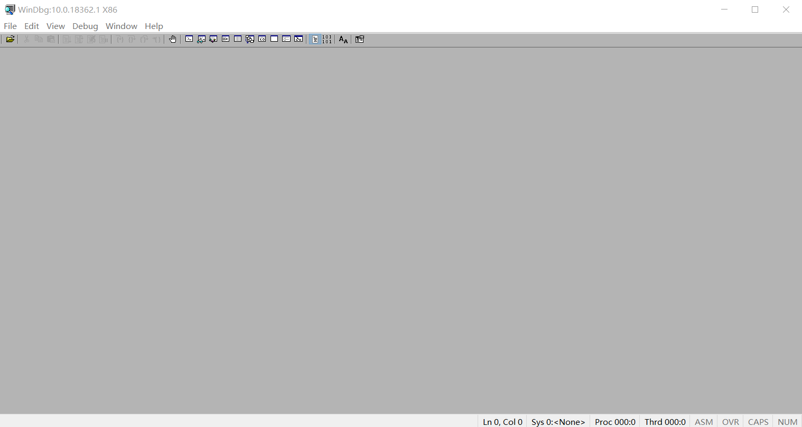
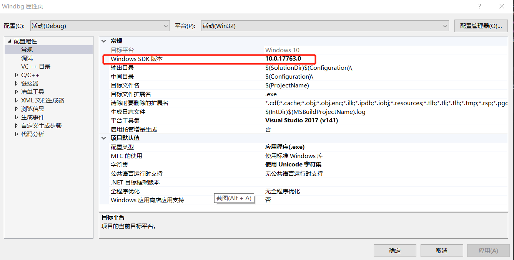
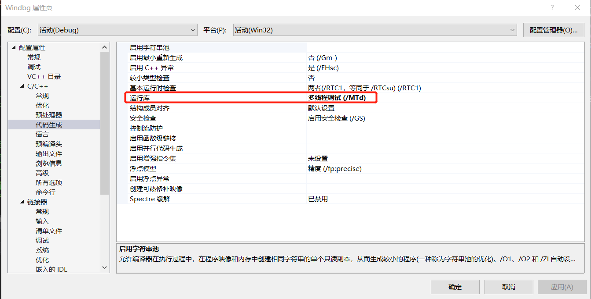
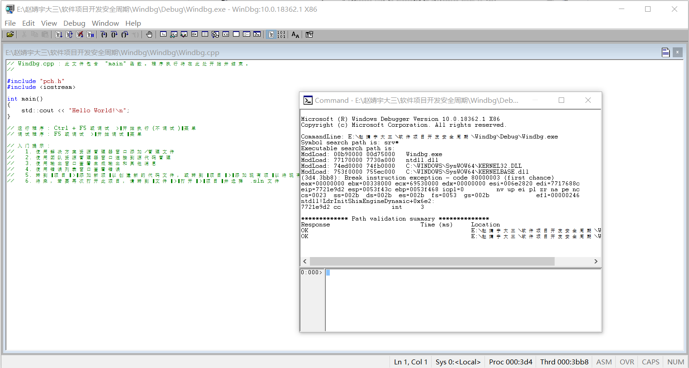
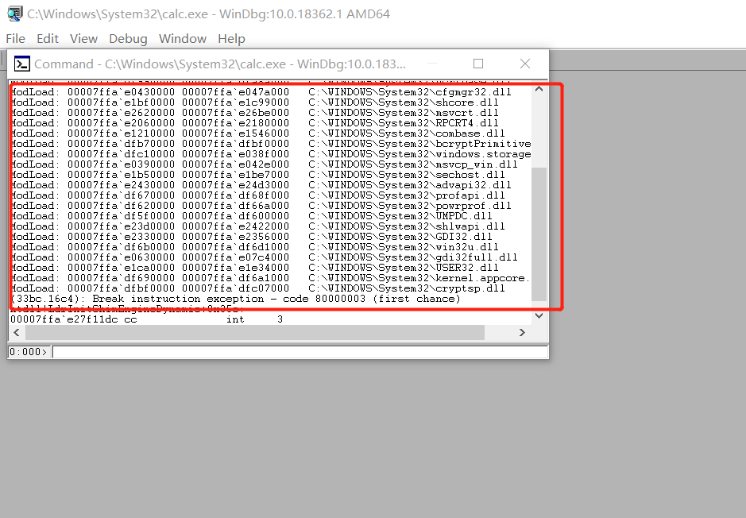
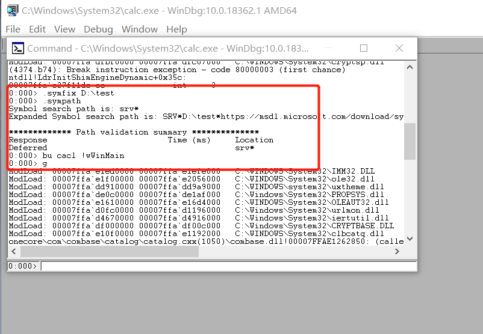
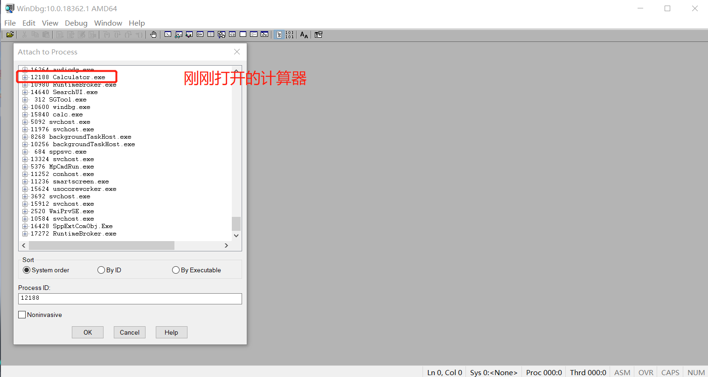
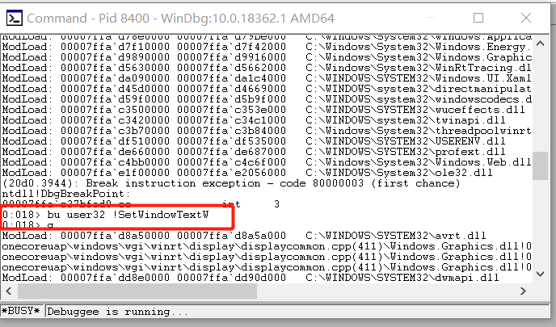

# WinDbg

## 基本使用

* 安装WinDbg调试器，其版本最好与可执行程序版本一致

  

  

* 在VS2017中写代码时，项目-属性-C/C++-代码生成-运行库选择多线程调试(/MTd)

  

* 在WinDbg中打开一个写的程序

  

* 可以开始直接调试

  #### 使用WinDng调试计算器

  * 打开WinDbg x64，打开C:\Windows\system32\calc.exe,可以看到这个程序调用的一系列的库

    

  * 下断点开始调试，入口函数为wWinMain

    

  * 继续运行，输入`g`

  * 在WinDbg中Attach to process中可以找到刚刚打开的计算器

    

  * 下断点进行调试，SetWindowTextW在user32模块中

    

    

  