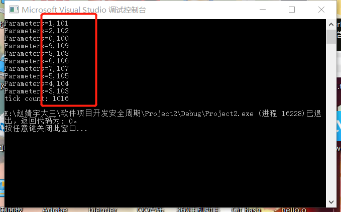
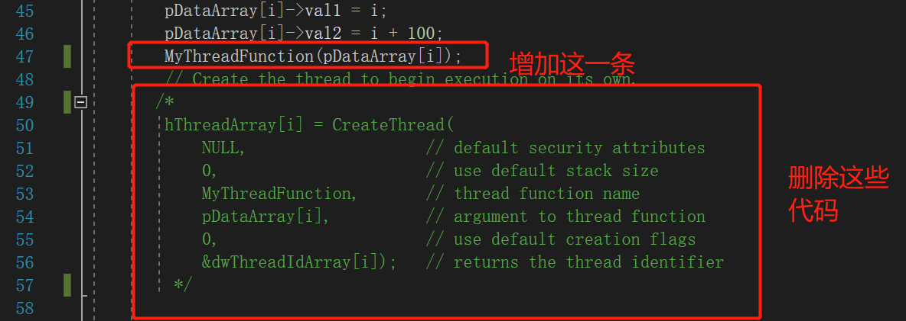
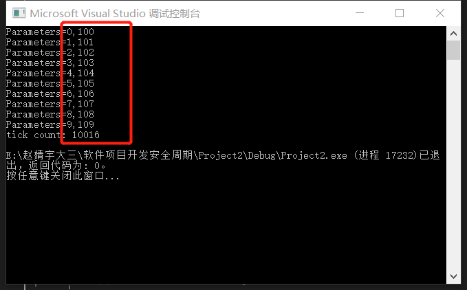
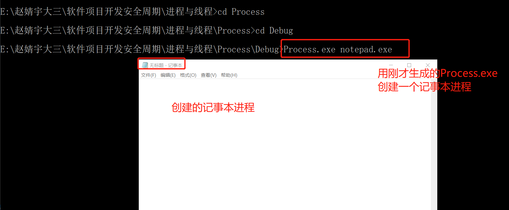
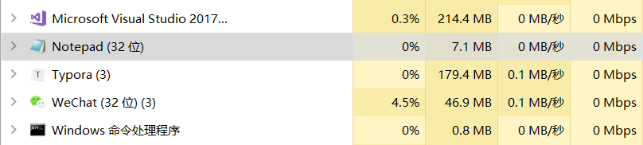
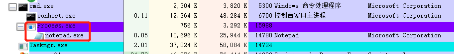

# 进程和线程的创建与管理

## 实验目的

在windows环境下利用相关代码实现进程和进程的创建和管理

，包括实现多线程并行。

## 实验环境

* Windows10
* VS2017

## 实验过程

### 线程的创建与管理

这里使用Windows自带的Createthread函数进行线程的创建

运行以下代码

```c
#include <windows.h>
#include <tchar.h>
#include <strsafe.h>

#define MAX_THREADS 10
#define BUF_SIZE 255

DWORD WINAPI MyThreadFunction(LPVOID lpParam);
//void ErrorHandler(LPTSTR lpszFunction);

// Sample custom data structure for threads to use.
// This is passed by void pointer so it can be any data type
// that can be passed using a single void pointer (LPVOID).
typedef struct MyData {
	int val1;
	int val2;
} MYDATA, *PMYDATA;

int _tmain()
{
	PMYDATA pDataArray[MAX_THREADS];
	DWORD   dwThreadIdArray[MAX_THREADS];
	HANDLE  hThreadArray[MAX_THREADS];

	// Create MAX_THREADS worker threads.
	DWORD start = GetTickCount();
	for (int i = 0; i < MAX_THREADS; i++)
	{
		// Allocate memory for thread data.

		pDataArray[i] = (PMYDATA)HeapAlloc(GetProcessHeap(), HEAP_ZERO_MEMORY,
			sizeof(MYDATA));

		if (pDataArray[i] == NULL)
		{
			// If the array allocation fails, the system is out of memory
			// so there is no point in trying to print an error message.
			// Just terminate execution.
			ExitProcess(2);
		}

		// Generate unique data for each thread to work with.

		pDataArray[i]->val1 = i;
		pDataArray[i]->val2 = i + 100;

		// Create the thread to begin execution on its own.

		hThreadArray[i] = CreateThread(
			NULL,                   // default security attributes
			0,                      // use default stack size  
			MyThreadFunction,       // thread function name
			pDataArray[i],          // argument to thread function 
			0,                      // use default creation flags 
			&dwThreadIdArray[i]);   // returns the thread identifier 


		// Check the return value for success.
		// If CreateThread fails, terminate execution. 
		// This will automatically clean up threads and memory. 

		if (hThreadArray[i] == NULL)
		{
			//下句改为
			printf("CreateThread Error(%d)", GetLastError());
			//ErrorHandler(TEXT("CreateThread"));
			ExitProcess(3);
		}
	} // End of main thread creation loop.

	// Wait until all threads have terminated.

	WaitForMultipleObjects(MAX_THREADS, hThreadArray, TRUE, INFINITE);
	DWORD end = GetTickCount();
	printf("tick count: %d\n", end - start);
	// Close all thread handles and free memory allocations.

	for (int i = 0; i < MAX_THREADS; i++)
	{
		CloseHandle(hThreadArray[i]);
		if (pDataArray[i] != NULL)
		{
			HeapFree(GetProcessHeap(), 0, pDataArray[i]);
			pDataArray[i] = NULL;    // Ensure address is not reused.
		}
	}

	return 0;
}


DWORD WINAPI MyThreadFunction(LPVOID lpParam)
{
	PMYDATA pDataArray;

	// Make sure there is a console to receive output results. 

	// Cast the parameter to the correct data type.
	// The pointer is known to be valid because 
	// it was checked for NULL before the thread was created.

	pDataArray = (PMYDATA)lpParam;
	Sleep(1000);
	// Print the parameter values using thread-safe functions.
	printf("Parameters=%d,%d\n", pDataArray->val1, pDataArray->val2);
	
	return 0;
}
```

这里创建了十个线程，可以看到这些线程是并发执行的



接着将代码做以下修改，变为单线程运行，时间变为原来时间的10倍，并且显示相关信息不是同时进行输出的，而是会延迟一些时间才会显示下一个，各线程执行的顺序也按照序号顺序执行。





### 进程的创建与管理

这里使用CreateProcess函数进行进程的创建

运行以下代码

```c
#include <windows.h>
#include <stdio.h>
#include <tchar.h>

void _tmain( int argc, TCHAR *argv[] )
{
    STARTUPINFO si;
    PROCESS_INFORMATION pi;

    ZeroMemory( &si, sizeof(si) );
    si.cb = sizeof(si);
    ZeroMemory( &pi, sizeof(pi) );

    if( argc != 2 )
    {
        printf("Usage: %s [cmdline]\n", argv[0]);
        return;
    }

    // Start the child process. 
    if( !CreateProcess( NULL,   // No module name (use command line)
        argv[1],        // Command line
        NULL,           // Process handle not inheritable
        NULL,           // Thread handle not inheritable
        FALSE,          // Set handle inheritance to FALSE
        0,              // No creation flags
        NULL,           // Use parent's environment block
        NULL,           // Use parent's starting directory 
        &si,            // Pointer to STARTUPINFO structure
        &pi )           // Pointer to PROCESS_INFORMATION structure
    ) 
    {
        printf( "CreateProcess failed (%d).\n", GetLastError() );
        return;
    }

    // Wait until child process exits.
    WaitForSingleObject( pi.hProcess, INFINITE );

    // Close process and thread handles. 
    CloseHandle( pi.hProcess );
    CloseHandle( pi.hThread );
}
```

在命令行中进入生成的.exe文件目录下

使用命令创建进程,用前一个进程创建第二个进程，我们这里创建了记事本的进程



我们可以在任务管理器中查看该进程的存在



使用Process Explore可以查看进程间关系的详细信息，可以看到记事本进程在之前编译生成的.exe进程下，是它的子进程，Process.exe是父进程



## 实验总结

* CreateThread函数能实现多线程并行
* 进程之间存在父子关系，父进程调用子进程
* 子进程结束后父进程也跟着结束

